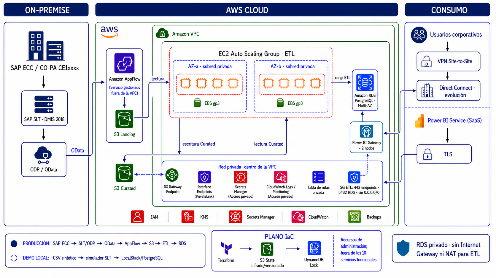

# Migración de la Plataforma Analítica SAP ERP hacia AWS

Proyecto integrador del módulo Cloud Computing (ITBA).

> **Autor:** Diego Lagre — entrega individual.

> **Entrega:** la guía compacta para evaluación y defensa está en
> [`docs/delivery-guide.md`](docs/delivery-guide.md).
> La presentación final está disponible en
> [`outputs/proyecto-final-sap-analytics-aws.pptx`](outputs/proyecto-final-sap-analytics-aws.pptx).
> El guion y las preguntas probables están en
> [`docs/defense-script.md`](docs/defense-script.md).

El proyecto migra la capa analítica de un SAP ERP on-premise hacia AWS. La
extracción se realiza desde el ERP mediante SAP SLT; SAP BW no forma parte del
flujo de origen.

Para la evaluación se declaran exactamente diez servicios AWS principales:
IAM, Amazon VPC, Amazon S3, Amazon AppFlow, Amazon EC2, Amazon EBS, EC2 Auto
Scaling, Amazon RDS for PostgreSQL, AWS Secrets Manager y Amazon CloudWatch.
KMS, Site-to-Site VPN y backups se presentan como capacidades transversales de
seguridad, conectividad y continuidad, no como servicios adicionales del núcleo
evaluado. El bucket S3 y la tabla DynamoDB del estado Terraform pertenecen al
plano de administración de IaC y tampoco forman parte del flujo analítico.

La solución combina VPC, IAM, S3, EC2 y Amazon RDS PostgreSQL. La demostración
es local-first: LocalStack emula los servicios AWS y un contenedor PostgreSQL
representa RDS. La documentación conserva AWS real como arquitectura objetivo.

## Alcance

- Origen: SAP ERP on-premise, tabla CO-PA con aproximadamente 45 millones de registros.
- Replicación: SAP SLT, representado localmente por un proceso controlado.
- Ingesta: bucket S3 Landing.
- Transformación: proceso ETL con identidad IAM de mínimo privilegio.
- Ingesta productiva: Amazon AppFlow consume el OData publicado sobre SLT/ODP.
- Cómputo productivo: workers EC2 administrados mediante Auto Scaling.
- Datos refinados: bucket S3 Curated.
- Consumo: Amazon RDS PostgreSQL con modelo dimensional.
- Conectividad: VPN Site-to-Site en la primera fase; Direct Connect como evolución.
- Acceso: usuarios corporativos por red privada y Power BI Service mediante gateway y TLS.

```text
SAP ERP -> SAP SLT -> ODP/OData -> VPN / Direct Connect
    -> AppFlow -> S3 Landing -> EC2 Auto Scaling ETL -> S3 Curated
    -> RDS PostgreSQL -> BI / usuarios
```

RDS permanece en subred privada y no se expone públicamente.

## Arquitectura cerrada

La arquitectura productiva definitiva y su comparación con la demostración
local están documentadas en [`docs/architecture.md`](docs/architecture.md). La
imagen actualizada para la presentación está disponible en
[`outputs/arquitectura-sap-erp-slt-aws-consumo-v5.png`](outputs/arquitectura-sap-erp-slt-aws-consumo-v5.png).



El escenario base de capacidad, crecimiento y escalabilidad se detalla en
[`docs/sizing.md`](docs/sizing.md).
Los controles de identidad, cifrado, secretos y monitoreo se describen en
[`docs/security.md`](docs/security.md).
La capacitación, comunicación, adopción y transferencia a operación se detallan
en [`docs/change-management.md`](docs/change-management.md).
Los objetivos SMART, el cronograma, el corte y la reversa están definidos en
[`docs/migration-plan.md`](docs/migration-plan.md).
La estimación mensual reproducible y sus supuestos se encuentran en
[`docs/cost-estimate.md`](docs/cost-estimate.md).
La evidencia oficial y su conciliación con la VPN complementaria están en
[`docs/aws-pricing-calculator-evidence.md`](docs/aws-pricing-calculator-evidence.md).
La auditoría final y los pendientes externos están registrados en
[`docs/readiness-audit.md`](docs/readiness-audit.md).

## Estado actual

La implementación incluye la arquitectura, el entorno local, la infraestructura
Terraform base y una demostración reproducible de carga inicial e incremental.

## Cómo arrancar

### Requisitos

- Docker con Docker Compose
- Terraform 1.5 o superior
- Python 3.11 o superior

### Entorno local

```bash
cp .env.example .env
./scripts/bootstrap.sh
```

- LocalStack: `http://localhost:4566`
- PostgreSQL: `localhost:5432`

El bootstrap levanta los contenedores y materializa cinco servicios AWS en
LocalStack: S3, IAM, VPC/EC2, Secrets Manager y CloudWatch Logs. Es idempotente
y se puede ejecutar nuevamente sin duplicar recursos.

### Demostración end-to-end

```bash
python3 -m pip install -r requirements.txt
./scripts/run_demo.sh
./scripts/check.sh
```

La demostración genera un CSV sintético inicial y otro incremental, simula SAP
SLT, publica ambos en S3 Landing, transforma los registros hacia S3 Curated y
los carga de forma idempotente en PostgreSQL.

Los datos no provienen de un sistema productivo. Los nombres de compañías,
clientes, materiales, documentos e importes son completamente ficticios.

Para la exposición se puede ejecutar todo el recorrido, los controles y el
cálculo de costos con un único comando:

```bash
./scripts/presentation_demo.sh
```

### Infraestructura Terraform

```bash
cd iac
terraform init -backend=false
terraform validate
terraform plan
terraform apply
```

AppFlow y EC2 Auto Scaling se mantienen desactivados en el entorno local. Para
una planificación productiva se habilitan mediante variables:

```bash
terraform plan \
  -var='use_localstack=false' \
  -var='create_appflow=true' \
  -var='appflow_connector_profile_name=<perfil-sap-odata>' \
  -var='appflow_sap_object_path=<entity-set-copa>' \
  -var='create_compute=true' \
  -var='create_private_endpoints=true' \
  -var='ec2_ami_id=<ami-aprobada>' \
  -var='create_rds=true' \
  -var='create_security_baseline=true'
```

El Connector Profile no se crea en este módulo para evitar guardar la
contraseña SAP dentro del estado Terraform.
Las instrucciones para crear y utilizar el backend remoto productivo están en
[`iac/bootstrap-state/README.md`](iac/bootstrap-state/README.md).

## Estructura

```text
.
├── compose.yaml             # LocalStack + PostgreSQL
├── costs/                   # Precios y supuestos reproducibles
├── docs/
│   ├── architecture.md      # Arquitectura y conectividad
│   ├── decisions.md         # Decisiones de arquitectura
│   ├── sizing.md            # Volumen, capacidad y escalabilidad
│   ├── security.md          # Seguridad y monitoreo
│   ├── change-management.md # Adopción, capacitación y operación
│   ├── migration-plan.md    # Objetivos SMART y cronograma
│   ├── cost-estimate.md     # Estimación mensual AWS
│   ├── aws-pricing-calculator-evidence.md # Evidencia oficial pendiente
│   ├── delivery-guide.md    # Entrega breve y matriz de evidencias
│   ├── defense-script.md    # Guion y preguntas de la defensa
│   └── readiness-audit.md   # Auditoría previa a la entrega
├── iam/
│   └── trust_policy.json    # EC2 asume el rol de integración
├── iac/                     # Infraestructura como código
├── postgres/init/           # Inicialización del Data Warehouse local
├── scripts/                 # Extracción, ETL y validaciones
└── tests/                   # Pruebas automatizadas
```

## Checklist de entrega

- [x] Arquitectura y componentes documentados
- [x] Once decisiones de arquitectura
- [x] Política IAM del proceso ETL
- [x] Demostraciones automatizadas e idempotentes
- [x] Servicios locales definidos en `compose.yaml`
- [x] Cinco servicios AWS materializados y verificados en LocalStack
- [x] Pruebas unitarias con `pytest`
- [x] Ejecución end-to-end documentada y validada
- [x] Dimensionamiento y estimación mensual de costos

## Referencias del curso

- [cloud-foundations-lab](https://github.com/diegolagre/cloud-foundations-lab),
  fuente principal de patrones para Docker Compose, LocalStack, Terraform,
  carga a almacenamiento de objetos, PostgreSQL, bootstrap y validaciones.
- AWS Academy Cloud Architecting (Spanish LATAM)

## Política de reutilización

Las implementaciones del proyecto deben partir de los ejemplos funcionales de
`cloud-foundations-lab` siempre que exista un patrón equivalente. La adaptación
puede cambiar nombres, datos y alcance para representar SAP ERP, SAP SLT y
CO-PA, pero debe preservar las convenciones probadas del laboratorio:

- configuración mediante variables de entorno;
- scripts idempotentes y sin secretos embebidos;
- clientes `boto3` compatibles con endpoints locales;
- carga PostgreSQL mediante archivos SQL versionados;
- bootstrap y controles automáticos reproducibles;
- Terraform con AWS Provider configurado para LocalStack.
