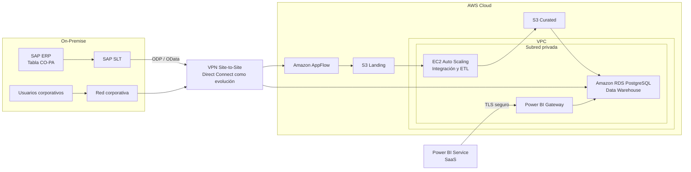

# Arquitectura — Migración de la Plataforma Analítica SAP ERP hacia AWS

## Objetivo

Migrar la plataforma analítica asociada a SAP ERP sin migrar el ERP
transaccional. SAP ERP continúa on-premise y SAP SLT replica los datos hacia
AWS. SAP BW no participa como fuente de extracción.

## Diagrama lógico



La imagen de presentación se encuentra en
`outputs/arquitectura-sap-erp-slt-aws-consumo.png`. El diagrama Mermaid es la
versión mantenible y debe actualizarse junto con la infraestructura.

## Límites de la simulación

| Arquitectura objetivo | Demostración local |
|---|---|
| SAP ERP | Archivos de muestra CO-PA |
| SAP SLT | Script idempotente de extracción/replicación |
| Amazon AppFlow | El simulador SLT carga directamente en S3 Landing |
| Amazon S3 | S3 emulado en LocalStack |
| EC2 Auto Scaling | Proceso ETL ejecutado localmente |
| Amazon RDS PostgreSQL | Contenedor PostgreSQL |
| VPN / Direct Connect | Límite lógico documentado |
| Power BI Gateway | Componente lógico documentado |

Los archivos `copa_initial.csv` y `copa_delta_001.csv` son sintéticos y
reproducibles. No contienen nombres, identificadores, importes ni estructuras
extraídas de la tabla CE1 productiva. Los 45 millones de registros se utilizan
únicamente como referencia de dimensionamiento.

## Componentes

| Componente local | Equivalente cloud | Identidad / credencial |
|---|---|---|
| Archivos CO-PA | SAP ERP | Acceso local de solo lectura |
| Script de replicación | SAP SLT | Rol de integración |
| LocalStack S3 | Amazon S3 | Rol IAM, sin access keys en código |
| Worker ETL | Amazon EC2 | Instance profile de integración |
| PostgreSQL | Amazon RDS PostgreSQL | Variable local; Secrets Manager en AWS |

## Puntos únicos de falla

| SPOF | Mitigación en cloud |
|---|---|
| Única instancia ETL | Auto Scaling o ejecución reemplazable; persistencia en S3 |
| RDS en una sola AZ | RDS Multi-AZ y backups automáticos |
| VPN como único enlace | Segundo túnel VPN; Direct Connect como evolución |
| Gateway de Power BI único | Clúster de gateways con al menos dos nodos |
| Credenciales estáticas | Roles IAM y rotación con Secrets Manager |

## Decisiones de identidad

- EC2 usa un instance profile limitado a los buckets Landing y Curated.
- Los buckets bloquean acceso público y requieren cifrado.
- RDS acepta conexiones sólo desde los security groups del ETL y del gateway.
- Los usuarios corporativos acceden por VPN o Direct Connect.
- Power BI Service accede mediante Power BI Gateway y TLS.
- Las credenciales de base se almacenan y rotan con Secrets Manager en AWS.

## Flujo de datos

1. SAP SLT publica la tabla CO-PA como proveedor ODP con delta queue.
2. El proveedor se expone mediante OData y AppFlow realiza cargas incrementales hacia S3 Landing.
3. Workers EC2 en Auto Scaling validan, transforman y escriben los datos en S3 Curated.
4. El ETL actualiza el modelo dimensional en RDS PostgreSQL.
5. Usuarios internos consultan por red privada y Power BI utiliza el gateway.

## Diferencia entre demostración y producción

```text
Demostración: CSV sintético -> simulador SLT -> S3 Landing -> ETL local
Producción:   SAP ECC -> SLT/ODP -> OData -> AppFlow -> S3 Landing -> EC2 Auto Scaling
```

AppFlow y el Auto Scaling Group están definidos en Terraform pero desactivados
por defecto. Para activar AppFlow primero se necesita el `EntitySet` OData de
CO-PA y un Connector Profile creado con credenciales almacenadas de forma segura.
