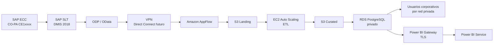

# Guía de entrega y defensa

Este documento resume el plan en cinco hojas lógicas. Los documentos enlazados
contienen el detalle técnico y el repositorio conserva toda la implementación
reproducible.

---

## Hoja 1 — Caso, alcance y resultado esperado

### Problema

La organización mantiene SAP ECC on-premise y necesita desacoplar el análisis de
rentabilidad CO-PA de la plataforma transaccional. El universo de referencia es
una tabla `CE1xxxx` de aproximadamente 45 millones de registros. SAP BW no forma
parte del flujo elegido.

### Alcance

Se migra un componente conocido: la plataforma de extracción, almacenamiento,
transformación y consumo analítico. SAP ECC permanece on-premise. Para proteger
la confidencialidad, el proyecto usa información CO-PA completamente sintética.

### Objetivos principales

- Disponer de infraestructura reproducible para al menos cuatro servicios AWS.
- Ejecutar cargas iniciales e incrementales sin pérdida ni duplicación.
- Mantener RDS privado y el acceso SaaS mediante Power BI Gateway.
- Completar el corte analítico en diez semanas, con una interrupción menor a
  cuatro horas y reversa documentada.
- Mantener el escenario productivo base alrededor de USD 662 mensuales antes de
  descuentos e impuestos.

La demostración local termina con 1.050 registros únicos: 1.000 iniciales y 50
incrementales. Se puede ejecutar repetidamente con el mismo resultado.

---

## Hoja 2 — Arquitectura y decisiones



### Servicios y justificación

| Servicio | Función | Motivo frente a la alternativa |
|---|---|---|
| VPC | Aislamiento y subredes privadas | Evita exponer ETL y RDS a Internet |
| IAM | Roles y permisos mínimos | Evita access keys dentro del código |
| AppFlow | OData incremental hacia S3 | Reduce el mantenimiento de un conector propio |
| S3 | Landing y Curated | Conserva originales y permite reprocesar |
| EC2 Auto Scaling | Transformación controlada | Admite librerías y procesos más largos que Lambda |
| RDS PostgreSQL | Modelo dimensional | Menor complejidad inicial que Redshift para este volumen |
| KMS/Secrets Manager | Cifrado y credenciales | Controla claves y evita secretos en Terraform |
| CloudWatch | Métricas y alarmas | Detecta saturación, falta de espacio y atraso |

La arquitectura detallada y las alternativas descartadas están en
[`architecture.md`](architecture.md) y [`decisions.md`](decisions.md).

---

## Hoja 3 — Dimensionamiento, seguridad y continuidad

### Capacidad base

| Componente | Configuración productiva |
|---|---|
| AppFlow | Incremental cada hora; carga inicial particionada por ejercicio/período |
| S3 | 100 GiB iniciales; previsión de 200 GiB durante el primer año |
| ETL | `m6i.large`, mínimo 1, deseado 1, máximo 4 workers |
| RDS | `db.m6g.large`, Multi-AZ, 100 GiB gp3, máximo 200 GiB |
| Backup RDS | Retención de 14 días |
| Red híbrida | VPN con dos túneles; al menos 100 Mbit/s efectivos para la carga inicial |

Los 2 GiB observados en Datasphere son una referencia comprimida y no se usan
como equivalencia directa de CSV o PostgreSQL. Se proyectan 45–54 GiB para la
extracción inicial y 40–60 GiB de huella inicial en RDS. Antes de producción se
ejecuta una prueba sintética de al menos 4,5 millones de filas.

### Controles principales

- Cifrado KMS con rotación para S3 y RDS.
- S3 bloquea acceso público y exige transporte seguro.
- RDS genera la credencial maestra en Secrets Manager.
- ETL sólo lee Landing, escribe Curated y utiliza su clave autorizada.
- RDS acepta conexiones exclusivamente desde security groups aprobados.
- Producción utiliza Multi-AZ, backups, protección contra borrado y alarmas.
- Power BI usa un usuario de sólo lectura y un clúster de dos gateways.

Objetivo operativo inicial: RPO analítico de una hora, interrupción de reportes
menor a cuatro horas durante el corte y restauración ensayada antes del Go-Live.

---

## Hoja 4 — Cronograma y corte

| Semanas | Etapa | Resultado |
|---|---|---|
| 1–2 | Preparación | Alcance, accesos, seguridad y conectividad aprobados |
| 2–4 | Construcción | Infraestructura y publicación ODP/OData listas |
| 4–7 | Pruebas | Funcional, volumen, recuperación y aceptación BI |
| 7–8 | Ensayo | Corte y reversa ejecutados de punta a punta |
| 8–9 | Corte | Histórico, delta final, conciliación y habilitación |
| 9–10 | Hypercare | Cinco días hábiles sin incidentes críticos y transferencia operativa |

### Condiciones de Go/No-Go

- Histórico y delta conciliados.
- Diferencias de filas e importes menores o iguales a 0,1 % y explicadas.
- Backup disponible y restauración probada.
- Dataset, gateway y usuarios de lectura validados.
- Alarmas y responsables operativos activos.
- Plataforma anterior disponible en modo consulta.

Se revierte ante diferencias no explicadas superiores a 0,1 %, delta detenido
por más de dos horas, consulta crítica incorrecta o incidente grave de seguridad.
La reversa reactiva el consumo anterior y conserva Landing y RDS para diagnóstico.

El Gantt completo, el RACI y las evidencias de cierre están en
[`migration-plan.md`](migration-plan.md).

---

## Hoja 5 — Costos, demostración y evidencia

### Estimación productiva

| Categoría | Mensual |
|---|---:|
| Power BI Gateway en AWS | USD 282,48 |
| RDS PostgreSQL Multi-AZ | USD 257,99 |
| EC2 ETL y EBS | USD 72,48 |
| Red | USD 38,30 |
| S3, AppFlow, seguridad y monitoreo | USD 10,97 |
| **Total mensual calculado** | **USD 662,22** |
| **Total anual sin descuentos** | **USD 7.946,64** |

El renglón agrupado suma varias categorías menores; el total se calcula desde
cada precio unitario versionado. La estimación
incluye transferencia saliente, backups adicionales, solicitudes S3, VPN, KMS,
secretos y logs. Excluye impuestos, soporte, licencias SAP/Power BI, Direct
Connect y horas profesionales.

### Demostración

```bash
cp .env.example .env
python3 -m pip install -r requirements.txt
./scripts/bootstrap.sh
./scripts/run_demo.sh
./scripts/check.sh
```

El bootstrap materializa cinco servicios en LocalStack: S3, IAM, VPC/EC2,
Secrets Manager y CloudWatch Logs. PostgreSQL representa RDS. El resultado
esperado del control es `13 OK / 0 WARN` y cinco pruebas aprobadas.

## Matriz de evidencias

| Criterio | Evidencia principal |
|---|---|
| Caso real y alcance | Esta guía y [`architecture.md`](architecture.md) |
| Tiempo y Gantt | [`migration-plan.md`](migration-plan.md) |
| Recursos dimensionados | [`sizing.md`](sizing.md) |
| Costos reproducibles | [`cost-estimate.md`](cost-estimate.md) y `costs/aws-us-east-1.json` |
| Cuatro o más servicios | `compose.yaml` y `scripts/bootstrap_cloud.py` |
| Seguridad y elementos no obvios | [`security.md`](security.md) |
| Código reproducible | `iac/`, `scripts/bootstrap.sh` y `scripts/run_demo.sh` |
| Validación | `scripts/check.sh` y `tests/` |

## Guion breve para la defensa

1. Explicar por qué se migra la analítica y no SAP ECC completo.
2. Recorrer el dato desde `CE1xxxx` hasta Power BI.
3. Defender AppFlow, separación Landing/Curated y RDS privado.
4. Mostrar los supuestos de 45 millones de registros y la prueba de volumen.
5. Exponer el camino crítico SAP/ODP/OData y el criterio de reversa.
6. Abrir el costo por RDS y gateways, donde están las decisiones económicas.
7. Ejecutar la demo y cerrar con `13 OK / 0 WARN`.
