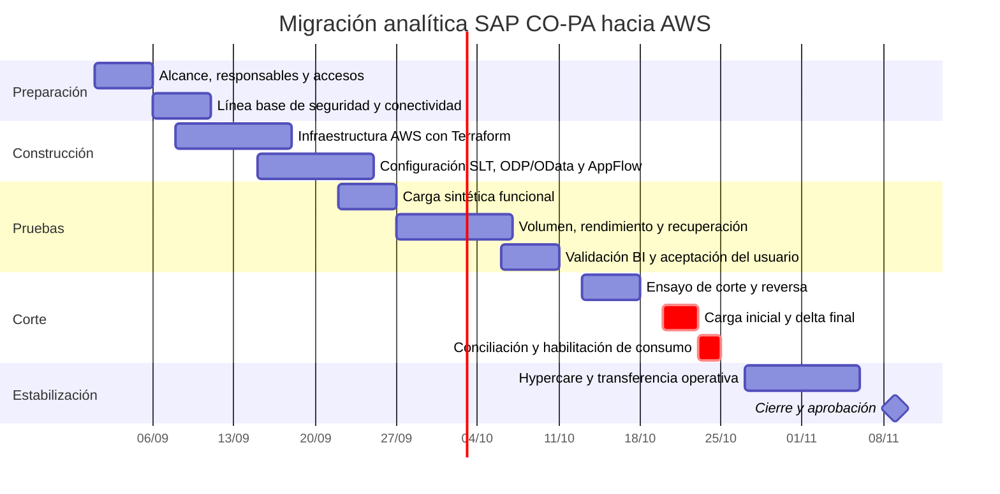

# Plan de implementación y migración

El cronograma propone diez semanas a partir del 1 de septiembre de 2026. La
fecha es una referencia de planificación y debe reemplazarse por la fecha
aprobada por el negocio. El alcance es la plataforma analítica de CO-PA; SAP ECC
permanece on-premise y SAP BW no participa del flujo.

## Objetivos SMART

| Objetivo | Indicador de éxito | Fecha objetivo |
|---|---|---|
| Construir la infraestructura analítica reproducible | VPC, IAM, S3, AppFlow, EC2 Auto Scaling y RDS definidos en Terraform y validados sin errores | Fin de semana 3 |
| Validar la ingesta sin datos confidenciales | Carga sintética inicial e incremental completa, idempotente y con 100 % de los controles automáticos aprobados | Fin de semana 5 |
| Demostrar capacidad para el volumen CO-PA | Prueba con al menos 4,5 millones de filas y proyección documentada a 45 millones; sin pérdida ni duplicados | Fin de semana 6 |
| Preparar el consumo analítico | Consultas de conciliación y vista de lectura para BI con tiempo p95 menor a 10 segundos en el conjunto de prueba | Fin de semana 7 |
| Ejecutar el corte controlado | Delta final conciliado, nueva plataforma habilitada y plataforma anterior en modo consulta | Fin de semana 9 |
| Estabilizar el servicio | Cinco días hábiles sin incidentes críticos y con alarmas, backups y restauración verificados | Fin de semana 10 |

## Cronograma



Las actividades de infraestructura y SAP pueden solaparse porque tienen
responsables diferentes. La carga productiva sólo comienza cuando seguridad,
conectividad, prueba de volumen y ensayo de reversa están aprobados.

## Etapas, entregables y responsables

| Etapa | Entregable | Responsable principal | Criterio de salida |
|---|---|---|---|
| Preparación | Alcance, RACI, accesos y ventana acordados | Líder del proyecto | Aprobación de negocio, SAP, seguridad y cloud |
| Conectividad | VPN con dos túneles y rutas verificadas | Redes | Conectividad privada estable y prueba TLS aprobada |
| Infraestructura | Recursos desplegados desde Terraform | Cloud engineer | `terraform validate/plan` aprobado y etiquetas completas |
| Integración SAP | EntitySet OData y delta disponibles | Equipo SAP Basis/SLT | Carga inicial y delta técnico sin errores |
| Datos | Landing, Curated y modelo dimensional | Data engineer | Recuento, claves e importes conciliados |
| Seguridad | KMS, IAM, secretos y alarmas | Seguridad/cloud | Sin secretos en código; accesos mínimos probados |
| BI | Dataset y gateway configurados | Equipo BI | Consultas funcionales y rendimiento aceptado |
| Corte | Nueva plataforma habilitada | Líder del proyecto | Aprobación Go/No-Go y controles de corte completos |
| Hypercare | Operación transferida | Operaciones | Cinco días sin incidentes críticos abiertos |

## Dependencias y camino crítico

```text
Accesos SAP
  -> conectividad privada
  -> publicación ODP/OData
  -> Connector Profile de AppFlow
  -> carga inicial
  -> conciliación
  -> habilitación de Power BI
```

Un retraso en SAP Gateway, certificados, firewall o aprobación del `EntitySet`
afecta directamente la fecha de corte. Por eso deben validarse durante las dos
primeras semanas y no al final del proyecto.

## Estrategia de pruebas

1. **Unitarias:** transformación de tipos, claves, importes e idempotencia.
2. **Integración:** CSV sintético → Landing → Curated → PostgreSQL.
3. **Conectividad:** SLT/ODP/OData → AppFlow sobre HTTPS y red privada.
4. **Volumen:** mínimo 10 % del universo estimado, con métricas de CPU, memoria,
   I/O, red y duración.
5. **Recuperación:** restauración de RDS y reproceso desde S3 Landing.
6. **Aceptación:** totales por sociedad, ejercicio, período y moneda, más
   consultas críticas de BI.

No se utilizarán registros productivos para las pruebas del proyecto. En una
implementación real, las conciliaciones se ejecutarían dentro del entorno
controlado y sólo expondrían totales técnicos autorizados.

## Plan de corte

### Preparación Go/No-Go

- Carga histórica terminada y conciliada.
- Delta de AppFlow funcionando dentro del objetivo de una hora.
- Backup de RDS disponible y restauración ensayada.
- Gateway de Power BI y usuarios de sólo lectura probados.
- Alarmas con responsables y canal de notificación activos.
- Plataforma anterior disponible en modo consulta.
- Aprobación conjunta de negocio, SAP, datos, seguridad y operaciones.

### Secuencia de corte

1. Registrar la marca de tiempo y el último delta procesado.
2. Pausar temporalmente la actualización de reportes anteriores.
3. Ejecutar el delta final y bloquear cambios de configuración.
4. Conciliar filas, importes y claves entre origen y destino.
5. Habilitar el dataset nuevo para el grupo piloto.
6. Validar consultas críticas y ampliar el acceso a todos los usuarios.
7. Mantener monitoreo reforzado durante cinco días hábiles.

La interrupción objetivo para los reportes es menor a cuatro horas. SAP ECC no
se detiene porque sólo cambia la plataforma de extracción y consumo analítico.

## Reversa

Se revierte si ocurre cualquiera de estas condiciones durante el corte:

- diferencia no explicada superior a 0,1 % en registros o importes;
- delta detenido durante más de dos horas;
- consulta crítica indisponible o con resultados incorrectos;
- incidente de seguridad de severidad alta;
- imposibilidad de restaurar o reprocesar los datos.

La reversa consiste en deshabilitar el dataset nuevo, reactivar la actualización
anterior, conservar Landing y RDS para diagnóstico y reanudar AppFlow desde el
último delta confirmado. No se elimina infraestructura ni información durante
la ventana de estabilización.

## RACI resumido

| Actividad | Negocio | Líder | SAP | Cloud/Data | Seguridad | BI/Operaciones |
|---|---|---|---|---|---|---|
| Aprobar alcance y criterios | A | R | C | C | C | C |
| Publicar ODP/OData | I | A | R | C | C | I |
| Desplegar infraestructura | I | A | C | R | C | C |
| Validar seguridad | I | C | C | R | A | C |
| Conciliar información | A | C | C | R | I | R |
| Decidir Go/No-Go | A | R | C | C | C | C |
| Operar después del corte | I | C | C | C | C | A/R |

R = responsable de ejecutar, A = responsable final, C = consultado e I =
informado.

## Evidencias de cierre

- Plan y salida de Terraform revisados.
- Resultados de pruebas automáticas y de volumen.
- Acta de conciliación sin datos confidenciales.
- Evidencia de backup y restauración.
- Registro de decisión Go/No-Go.
- Manual operativo y responsables de alarmas.
- Aceptación de negocio y cierre de hypercare.
